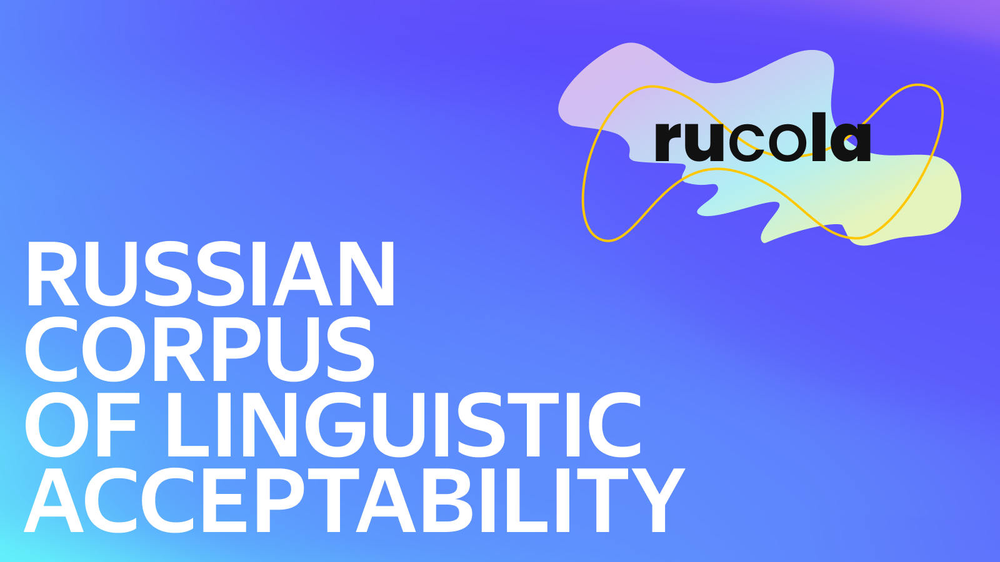

# RuCoLA



The Russian Corpus of Linguistic Acceptability (RuCoLA) is a dataset consisting of Russian language sentences with their binary acceptability judgements. It includes expert-written sentences from linguistic publications and machine-generated examples.

The corpus covers a variety of language phenomena, ranging from syntax and semantics to generative model hallucinations. We release RuCoLA to facilitate the development of methods for identifying errors in natural language and create a [public leaderboard](https://rucola-benchmark.com/) to track the progress on this problem.

The dataset is available on [HuggingFace](https://huggingface.co/datasets/RussianNLP/rucola) and in the [data/](./data) folder of the repository. 

Read more about RuCoLA in the corresponding [blog post](https://habr.com/ru/post/667336/) (in Russian).

## Sources
<details>
    <summary>Linguistic publications and resources</summary>

|Original source   |Transliterated source   |Source id   | 
|---|---|---|
|[Проект корпусного описания русской грамматики](http://rusgram.ru)   | [Proekt korpusnogo opisaniya russkoj grammatiki](http://rusgram.ru/)|Rusgram   |
|Тестелец, Я.Г., 2001. *Введение в общий синтаксис*. Федеральное государственное бюджетное образовательное учреждение высшего образования Российский государственный гуманитарный университет.|Yakov Testelets. 2001. Vvedeniye v obschiy sintaksis. Russian State University for the Humanities.   |Testelets   |
|Лютикова, Е.А., 2010. *К вопросу о категориальном статусе именных групп в русском языке*. Вестник Московского университета. Серия 9. Филология, (6), pp.36-76.   |Ekaterina Lutikova. 2010. K voprosu o kategorial’nom statuse imennykh grup v russkom yazyke. Moscow University Philology Bulletin.   |Lutikova   |
|Митренина, О.В., Романова, Е.Е. and Слюсарь, Н.А., 2017. *Введение в генеративную грамматику*. Общество с ограниченной ответственностью "Книжный дом ЛИБРОКОМ".   |Olga Mitrenina et al. 2017. Vvedeniye v generativnuyu grammatiku. Limited Liability Company “LIBROCOM”. |Mitrenina   |
|Падучева, Е.В., 2004. *Динамические модели в семантике лексики*. М.: Языки славянской культуры.| Elena Paducheva. 2004. Dinamicheskiye modeli v semantike leksiki. Languages of Slavonic culture. |Paducheva2004    |
|Падучева, Е.В., 2010. *Семантические исследования: Семантика времени и вида в русском языке; Семантика нарратива*. М.: Языки славянской культуры. | Elena Paducheva. 2010. Semanticheskiye issledovaniya: Semantika vremeni i vida v russkom yazyke; Semantika narrativa. Languages of Slavonic culture.|Paducheva2010    |
|Падучева, Е.В., 2013. *Русское отрицательное предложение*. М.: Языки славянской культуры |Elena Paducheva. 2013. Russkoye otritsatel’noye predlozheniye. Languages of Slavonic culture.  |Paducheva2013   |
|Селиверстова, О.Н., 2004. *Труды по семантике*. М.: Языки славянской культуры | Olga Seliverstova. 2004. Trudy po semantike. Languages of Slavonic culture.|Seliverstova    |
| Набор данных ЕГЭ по русскому языку | Shavrina et al. 2020. [Humans Keep It One Hundred: an Overview of AI Journey](https://aclanthology.org/2020.lrec-1.277/) |USE5, USE7, USE8    | 

</details>


<details>
    <summary>Machine-generated sentences</summary>
<br>

**Datasets**

|Original source |Source id|
|---|---|
|Mikel Artetxe and Holger Schwenk. 2019. [Massively Multilingual Sentence Embeddings for Zero-Shot Cross-Lingual Transfer and Beyond](https://direct.mit.edu/tacl/article/doi/10.1162/tacl_a_00288/43523/Massively-Multilingual-Sentence-Embeddings-for)|Tatoeba    |
|Holger Schwenk et al. 2021. [WikiMatrix: Mining 135M Parallel Sentences in 1620 Language Pairs from Wikipedia](https://aclanthology.org/2021.eacl-main.115/)|WikiMatrix    |
|Ye Qi et al. 2018. [When and Why Are Pre-Trained Word Embeddings Useful for Neural Machine Translation?](https://aclanthology.org/N18-2084/)|TED    |
|Alexandra Antonova and Alexey Misyurev. 2011. [Building a Web-Based Parallel Corpus and Filtering Out Machine-Translated Text](https://aclanthology.org/W11-1218/)|YandexCorpus    |

**Models**

[EasyNMT models](https://github.com/UKPLab/EasyNMT):
1. OPUS-MT. Jörg Tiedemann and Santhosh Thottingal. 2020. [OPUS-MT – Building open translation services for the World](https://aclanthology.org/2020.eamt-1.61/)
2. M-BART50. Yuqing Tang et al. 2020. [Multilingual Translation with Extensible Multilingual Pretraining and Finetuning](https://arxiv.org/abs/2008.00401)
3. M2M-100. Angela Fan et al. 2021. [Beyond English-Centric Multilingual Machine Translation](https://jmlr.org/papers/volume22/20-1307/20-1307.pdf)

[Paraphrase generation models](https://github.com/RussianNLP/russian_paraphrasers):
1. [ruGPT2-Large](https://huggingface.co/sberbank-ai/rugpt2large)
2. [ruT5](https://huggingface.co/cointegrated/rut5-base-paraphraser)
3. mT5. Linting Xue et al. 2021. [mT5: A Massively Multilingual Pre-trained Text-to-Text Transformer](https://aclanthology.org/2021.naacl-main.41/)

</details>


## Baselines
### Requirements
To set up the environment, you will need to install a recent version of PyTorch, scikit-learn and Transformers. 
The [requirements.txt](./baselines/requirements.txt) file contains the list of top-level packages used to train all models below.

### Models
Our code supports acceptability classification evaluation for the following scikit-learn and Hugging Face🤗 Transformers models:
* [Majority vote classifier](https://scikit-learn.org/stable/modules/generated/sklearn.dummy.DummyClassifier.html)
* [Logistic Regression + TF-IDF](https://scikit-learn.org/stable/modules/generated/sklearn.linear_model.LogisticRegression.html)
* [ruBERT](https://huggingface.co/sberbank-ai/ruBert-base)
* [ruT5](https://huggingface.co/sberbank-ai/ruT5-base)
* [ru-RoBERTa](https://huggingface.co/sberbank-ai/ruRoberta-large)
* [XLM-R](https://huggingface.co/xlm-roberta-base)
* [RemBERT](https://huggingface.co/google/rembert)


### Running experiments
To train acceptability classifiers on RuCoLA, run the following commands.

* scikit-learn models:
```
python baselines/train_sklearn_baselines.py -m {majority, logreg}
```

* Masked Language Model (e.g. ruBERT or XLM-R) finetuning:
```
python baselines/finetune_mlm.py -m [MODEL_NAME]
```

* ruT5 finetuning:
```
python baselines/finetune_t5.py -m [MODEL_NAME]
```

Afterwards, you can get test set predictions in the format required by the leaderboard for all trained models.
To do this, run `python baselines/get_csv_predictions.py -m MODEL1 MODEL2 ...`.

### Get finetuned models
If you want to use an acceptability classifier trained on RuCoLA for your applications without training it yourself, 
we provide the following checkpoints available on the Hugging Face Hub:
* [ruRoBERTa-large-rucola](https://huggingface.co/RussianNLP/ruRoBERTa-large-rucola)

## Contact us
For any questions about RuCoLA or this website, write to [contact@rucola-benchmark.com](mailto:contact@rucola-benchmark.com) or create an issue in this repository.

You can also join the [official Telegram chat](https://t.me/RuCoLA_benchmark) to discuss your ideas with others and to follow the latest updates of the project.

## Cite
Our [paper](https://aclanthology.org/2022.emnlp-main.348/) is accepted to the EMNLP 2022 main conference. 

If you use RuCoLA in your research, please cite the dataset using the following entry:
```
@inproceedings{mikhailov-etal-2022-rucola,
    title = "{R}u{C}o{LA}: {R}ussian Corpus of Linguistic Acceptability",
    author = "Mikhailov, Vladislav  and
      Shamardina, Tatiana  and
      Ryabinin, Max  and
      Pestova, Alena  and
      Smurov, Ivan  and
      Artemova, Ekaterina",
    booktitle = "Proceedings of the 2022 Conference on Empirical Methods in Natural Language Processing",
    month = dec,
    year = "2022",
    address = "Abu Dhabi, United Arab Emirates",
    publisher = "Association for Computational Linguistics",
    url = "https://aclanthology.org/2022.emnlp-main.348",
    pages = "5207--5227",
    abstract = "Linguistic acceptability (LA) attracts the attention of the research community due to its many uses, such as testing the grammatical knowledge of language models and filtering implausible texts with acceptability classifiers.However, the application scope of LA in languages other than English is limited due to the lack of high-quality resources.To this end, we introduce the Russian Corpus of Linguistic Acceptability (RuCoLA), built from the ground up under the well-established binary LA approach. RuCoLA consists of 9.8k in-domain sentences from linguistic publications and 3.6k out-of-domain sentences produced by generative models. The out-of-domain set is created to facilitate the practical use of acceptability for improving language generation.Our paper describes the data collection protocol and presents a fine-grained analysis of acceptability classification experiments with a range of baseline approaches.In particular, we demonstrate that the most widely used language models still fall behind humans by a large margin, especially when detecting morphological and semantic errors. We release RuCoLA, the code of experiments, and a public leaderboard to assess the linguistic competence of language models for Russian.",
}
```

## License
Our baseline code and acceptability labels are available under the Apache 2.0 license. The copyright (where applicable) of texts from the linguistic publications and resources remains with the original authors or publishers.

